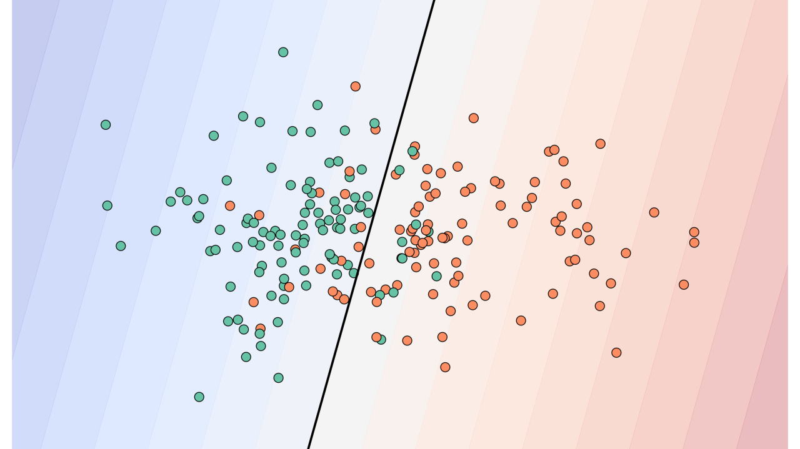

# Classificação de Câncer de Mama usando uma SVM 🧠

Este projeto demonstra na prática o uso uma Support Vector Machine (SVM) para classificar tumores como benignos ou malignos, com base no conjunto de dados Breast Cancer Wisconsin. O projeto cobre desde o pré-processamento até a visualização das fronteiras de decisão.



## Objetivo

Demonstrar o uso de SVMs em um problema real de classificação binária, aplicando conceitos como:

- Normalização de dados.
- Divisão em conjuntos de treino e teste.
- Ajuste de hiperparâmetros.
- PCA (Pricipal Components Analysis).
- Visualização das fronteiras de decisão.

## Artigo relacionado

Para entender o raciocínio por trás da técnica e aprofundar o conhecimento em SVM, confira o meu artigo completo no LinkedIn:

👉 [Usando SVM para Classificar Dados](https://www.linkedin.com/pulse/usando-svm-para-classificar-dados-patrick-regis-tf37f)

## Dataset

O conjunto de dados utilizado é o **Breast Cancer Wisconsin Diagnostic Dataset**, disponível via `sklearn.datasets`. Ele contém:

- 569 amostras
- 30 características numéricas extraídas de imagens digitalizadas de células tumorais.
- 2 classes-alvo (target): maligno e benigno.

--- 

# Executando o Código

Clone o repositório ou baixe o notebook abaixo:

   ```bash
   git clone https://github.com/pazaborgs/{{link_repo}}
   cd {{link_repo}}
   ```
   
Instale as dependências:

  ```bash
  pip install -r requirements.txt
  ```

Abra o arquivo com Jupyter Notebook ou ferramenta a sua escolha (Colab...):

  ```bash
  jupyter notebook breast_cancer_svm.ipynb
  ```
